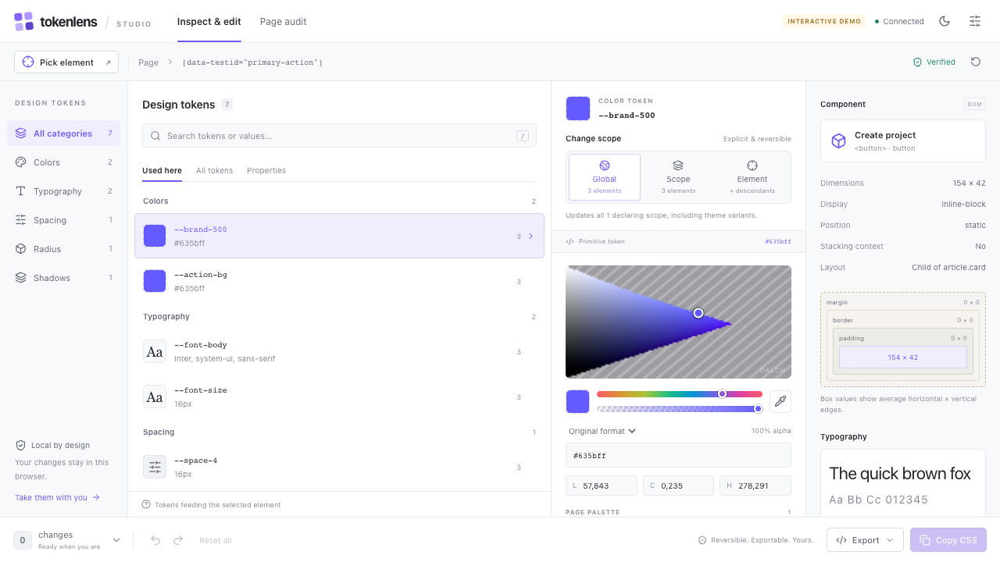

# TokenLens

**A design token studio inside Chrome DevTools.** Pick an element, see the CSS tokens behind it, edit its colors, typography, spacing and shadows live, and export your changes as a reusable CSS stylesheet.

Built by [Joan Sterjo](https://github.com/joansterjo).

**[Download TokenLens v0.1.0](https://github.com/joansterjo/tokenlens/releases/download/v0.1.0/tokenlens-0.1.0.zip)** · [Download with per-site permissions](https://github.com/joansterjo/tokenlens/releases/download/v0.1.0/tokenlens-0.1.0-optional-permissions.zip) · [Release notes](https://github.com/joansterjo/tokenlens/releases/tag/v0.1.0)



*Interface preview using the included demo data. On a website, the Tokens panel shows the selected element's live styles.*

## Install the extension

No coding or build tools are needed to use the downloads. This is an unpacked Chrome extension release; it is not published in the Chrome Web Store.

1. Download one of the ZIP files above and **extract it** into a folder you will keep.
2. Open `chrome://extensions` in Chrome and enable **Developer mode**.
3. Click **Load unpacked** and select the extracted folder containing `manifest.json`.
4. Reload the website you want to inspect. Right-click the page → **Inspect**, then open the **Tokens** tab in DevTools. It may be in the **»** overflow menu.

| Download | Site access | Best for |
| --- | --- | --- |
| [Standard ZIP](https://github.com/joansterjo/tokenlens/releases/download/v0.1.0/tokenlens-0.1.0.zip) | Requests access to all supported pages at installation | Getting started with minimal setup |
| [Per-site permissions ZIP](https://github.com/joansterjo/tokenlens/releases/download/v0.1.0/tokenlens-0.1.0-optional-permissions.zip) | Requests access to an individual HTTP/HTTPS site when you connect it | Choosing which sites TokenLens can inspect |

For the per-site build, open the extension from Chrome's toolbar, click **Connect this site**, and grant the requested site access before inspecting. Reload the page if needed. Install only one build at a time.

For local HTML files, use the standard build and enable **Allow access to file URLs** in the extension's details. The manifest requires Chrome 120 or newer; see [verification](docs/verification.md) for the browser versions actually tested.

## Pick → edit → export

1. **Pick an element.** Click **Pick element** in Tokens and select something on the page, or select a node in DevTools' Elements panel. Explore its token aliases, computed values, source selectors and component metadata.
2. **Make the change.** Click a color swatch, enter a CSS value, or drag a numeric field. Choose the edit scope and see the result immediately. Undo, redo or revert individual edits as you work.
3. **Take the CSS with you.** Open export from the bottom edit bar, choose an output target, then copy or download the stylesheet. You can also save a JSON edit session to restore later.

### What you can inspect and edit

| Tool | What it does |
| --- | --- |
| Token inspector | Shows CSS custom properties, alias relationships, computed values, declaration sources, cascade details and provenance diagnostics |
| Color editor | Provides a visual picker, page swatches, CSS color entry and a screen eyedropper where Chrome supports it |
| Typography | Edits font family, size, weight, line height and letter spacing, with a font stack specimen |
| Shadows and dimensions | Edits shadow values, spacing and other numeric CSS properties with live preview |
| Component details | Shows DOM identity, attributes, dimensions, box model, layout, stacking context, font stack, pseudo-element presence and approximate accessibility information |
| Page audit | Scans on demand for token inventory, hardcoded values, repeated values, potentially unused tokens and contrast findings; exports JSON and CSV |
| Edit history | Supports undo/redo, per-edit revert, and JSON session import/export |

Component details describe the rendered DOM. They do not identify React, Vue or other framework components from their source code.

### Choose the reach of an edit

- **Global:** override a token at its declaring scopes.
- **Scope:** override a token within one selector or theme scope.
- **Element:** override the selected element; inherited token values can also affect its descendants.

Previews use a separate author-origin stylesheet. Reverting removes the override and restores the page's own styling. Edits survive closing and reopening DevTools for the current document; navigation starts a new document session. Save a JSON session if you need to keep your work.

### CSS export targets

| Target | Use it for |
| --- | --- |
| Full stylesheet / Stylus | Complete CSS with media, supports and container conditions preserved, suitable for a stylesheet or a CSS editor applying author-origin styles |
| Local Overrides | The same CSS plus setup guidance for DevTools → Sources → Overrides; save it into an override of a stylesheet the page loads |
| Inspector stylesheet | A temporary snapshot of currently verified edits with condition wrappers flattened; intended for the current viewport and theme |
| Source suggestion | Best-effort source hints and CSS for a developer to apply manually |

To paste a complete override, use a **stylesheet text editor** in DevTools Sources or a custom stylesheet editor. The temporary inspector stylesheet is not persisted by Local Overrides because it has no backing network resource. Bulk stylesheet paste into the Elements declaration editor has not been manually verified.

The export marks edits that cannot be reproduced, including certain shadow-root and inline `!important` conflicts. Source suggestions are not automatically applicable patches. Read the [export fidelity guide](docs/export-targets.md) for details.

## Permissions and privacy

TokenLens runs locally in your browser. It requires no account, sends no telemetry and has no hosted analysis service. It reads the inspected page's DOM and CSS to produce reports and uses browser storage for the current document's edit session.

- **Site access** lets the extension inspect and preview styles on a page. The standard build requests broad access; the alternative build lets you grant access per site.
- **`scripting`** injects the inspector and preview code into permitted pages.
- **`storage`** preserves session state across DevTools and service-worker reconnects.
- **`activeTab`** is included in the per-site build to support connecting the current page.

Stylesheet recovery can make a network request to an unreadable stylesheet's original URL. These requests use `credentials: 'omit'`; authenticated or personalized CSS may therefore differ from what the page loaded. Recovery remains subject to permissions and is reported in provenance diagnostics. Exported sessions and audit files may include the page URL, selectors and token values; review them before sharing.

## Development

Use **Node.js 22** and **pnpm 11.25.0**, matching the checked-in CI configuration.

```sh
git clone https://github.com/joansterjo/tokenlens.git
cd tokenlens
pnpm install --frozen-lockfile
pnpm build
```

Load the generated **`dist`** folder through `chrome://extensions`. `pnpm build:store` produces the per-site permissions build in **`dist-store`**; the script name does not imply Chrome Web Store publication.

To rebuild both downloadable ZIPs and their `SHA256SUMS` file in **`releases`**, run `pnpm package`. Release packaging also requires **Python 3**.

```sh
pnpm dev
```

Open `http://127.0.0.1:5173/src/panel/panel.html` for the interactive UI demo. Outside DevTools, the panel is labeled **Demo** and uses sample data. Development extension output is isolated in `dist-dev` so it does not overwrite production builds.

### Checks

```sh
pnpm exec playwright install chromium chrome
pnpm check
pnpm test:browser
pnpm build:store
pnpm test:e2e
```

`pnpm check` runs type checking, lint, Node tests, the production build and bundle-size checks. Browser tests use real browsers. Extension checks need Chromium or Chrome for Testing; on headless Linux, install browser dependencies and run them under Xvfb as shown in [CI](.github/workflows/check.yml). Set `CHROME_PATH` for DOM tests or `CHROMIUM_PATH` for extension tests to select a browser. `pnpm test:perf` runs the performance subset separately.

The initial release verification recorded **80 Node tests, 54 browser tests and 14 extension/platform/performance tests passing**. See the [verification report](docs/verification.md) for evidence, measurements and manual checks still outstanding.

## Known limits

- Computed styles come from the browser; token provenance is best-effort CSSOM analysis. Unreadable CSS, animations, JavaScript-registered custom properties and advanced container/scope conditions can leave attribution incomplete.
- Consumer counts are **estimated selector matches**, not exact counts of every element an edit will affect. Audit findings cover only readable styles and the scanned elements.
- Open shadow-root support is partial; some internal edits are preview-only. Closed shadow roots, browser UI, the Chrome Web Store, the built-in PDF viewer and canvas/video pixels cannot be inspected as ordinary DOM elements. Frame inspection depends on permissions.
- Pseudo-elements are listed but do not have independent editing reports. Exact rendered-font identification, APCA, recursive cross-origin `@import` recovery and automatic source-file patching are not implemented.
- Native per-site permission prompts, docked/undocked EyeDropper behavior and bulk declaration-editor paste still need manual verification. See [verification](docs/verification.md) and [resolver coverage](docs/resolver-verification.md).

## Project notes

[Original build plan](docs/TOKENLENS-BUILD-PLAN.md) · [Implementation decisions](docs/decisions.md) · [Platform probes](docs/spikes.md) · [Public-site field notes](docs/field-notes.md)

Found a bug or have a design workflow to improve? [Open an issue](https://github.com/joansterjo/tokenlens/issues) with your Chrome version, reproduction steps and a public example or minimal HTML fixture where possible.
